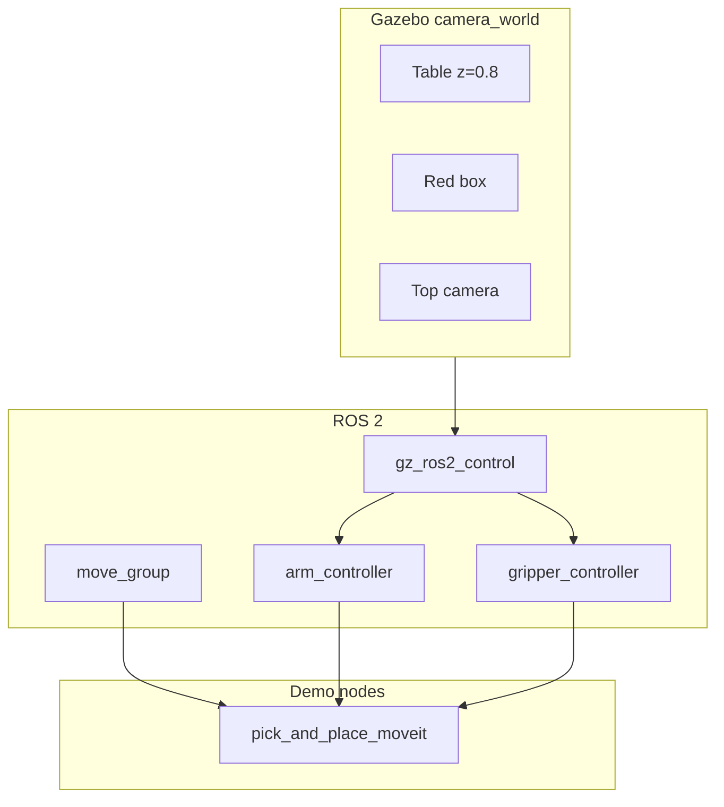

# UR5e Pick and Place

ROS 2 **Jazzy** simulation of a Universal Robots **UR5e** with a **Robotiq 2F-85** gripper performing pick-and-place in **Gazebo (GZ Sim)**. The primary demo uses **MoveIt2** for motion planning.

**Requirements:** Ubuntu 24.04, ROS 2 Jazzy, display or WSLg for Gazebo GUI (headless mode available).

Throughout this document, `<workspace>` means the path to `ur5e_ws` (e.g. `~/Projects/ur5e-pick-and-place/ur5e_ws`).

---

## Repository layout

```
ur5e-pick-and-place/
├── README.md
└── ur5e_ws/
    └── src/
        ├── ur5e_gazebo_demo/      # Simulation, launches, pick nodes, world
        ├── ur5e_moveit_config/    # MoveIt2 configuration
        └── ros2_robotiq_gripper/  # Vendored Robotiq description (meshes + xacro)
            └── robotiq_description/
```

| Package | Role |
|---------|------|
| `ur5e_gazebo_demo` | Gazebo world, URDF, controllers, MoveIt pick nodes, validation |
| `ur5e_moveit_config` | SRDF, kinematics, MoveIt controller mapping |
| `robotiq_description` | Robotiq 2F-85 URDF macros and meshes |

---

## Install and build

### 1. ROS 2 Jazzy and build tools

```bash
sudo apt update
sudo apt install -y git python3-pip python3-colcon-common-extensions python3-rosdep
sudo rosdep init   # skip if already initialized
rosdep update
sudo apt install -y ros-jazzy-desktop
```

Add to `~/.bashrc`:

```bash
source /opt/ros/jazzy/setup.bash
source <workspace>/install/setup.bash
```

### 2. Project dependencies

```bash
sudo apt install -y \
  ros-jazzy-ur-description \
  ros-jazzy-moveit \
  ros-jazzy-moveit-ros-move-group \
  ros-jazzy-moveit-configs-utils \
  ros-jazzy-ros-gz-sim \
  ros-jazzy-gz-ros2-control \
  ros-jazzy-ros2-controllers \
  ros-jazzy-joint-state-broadcaster \
  ros-jazzy-joint-trajectory-controller \
  ros-jazzy-controller-manager \
  ros-jazzy-robot-state-publisher \
  ros-jazzy-ros-gz-bridge \
  ros-jazzy-cv-bridge \
  ros-jazzy-vision-opencv \
  ros-jazzy-xacro \
  ros-jazzy-warehouse-ros-sqlite

pip3 install catkin_pkg empy lark ikpy opencv-python --break-system-packages
```

### 3. Build

```bash
source /opt/ros/jazzy/setup.bash
cd <workspace>
rosdep install --from-paths src --ignore-src -r -y
colcon build --symlink-install
source install/setup.bash
```

Verify:

```bash
ros2 pkg list | grep ur5e
# ur5e_gazebo_demo, ur5e_moveit_config, robotiq_description
```

---

## Quick start (MoveIt pick-and-place)

**Terminal 1 — simulation + MoveIt:**

```bash
source /opt/ros/jazzy/setup.bash
source <workspace>/install/setup.bash
ros2 launch ur5e_gazebo_demo pick_moveit.launch.py
```

Wait until:
- Gazebo shows the table, red box, and UR5e arm
- Log shows `Startup homing complete` (arm moves to HOME)
- Controllers are active: `ros2 control list_controllers`
- `move_group` is running (~12 s after launch)

**Terminal 2 — run pick task** (wait **15–20 s** after Terminal 1):

```bash
source /opt/ros/jazzy/setup.bash
source <workspace>/install/setup.bash
ros2 launch ur5e_gazebo_demo run_pick.launch.py
```

Expected sequence: open gripper → home → pre-grasp → grasp → lift → place → return home.

**Headless (no GUI):**

```bash
ros2 launch ur5e_gazebo_demo pick_moveit.launch.py headless:=true
# wait ~15–20 s, then:
ros2 launch ur5e_gazebo_demo run_pick.launch.py
```

**Vision-guided pick (single launch):**

```bash
ros2 launch ur5e_gazebo_demo vision_pick.launch.py
```

---

## Architecture



Gazebo loads `gz_ros2_control`, which exposes joints to ROS 2 trajectory controllers. MoveIt2 `move_group` plans via `/move_action`; the gripper uses `/gripper_controller/follow_joint_trajectory`.

---

## Notation and coordinate frames

### Frames

| Frame / link | Parent | Pose | Used for |
|--------------|--------|------|----------|
| `world` | — | Gazebo origin (ground z=0) | Scene SDF |
| `base_link` | `world` | `(0, 0, 0.80)`, yaw −90° | MoveIt goals, TF |
| `robotiq_85_base_link` | arm chain | Gripper TCP | Position constraints |
| Top camera | `world` (SDF) | `(0, 0, 2.5)` | Vision (not on TF tree) |

### World ↔ `base_link`

Robot mount in `ur5e.urdf.xacro`: `xyz="0 0 0.80" rpy="0 0 -1.5708"`.

```
base_x = -world_y
base_y =  world_x
base_z =  world_z - 0.80
```

Inverse:

```
world_x =  base_y
world_y = -base_x
world_z =  base_z + 0.80
```

### Scene reference points

| Point | World (x, y, z) | base_link (x, y, z) |
|-------|-----------------|---------------------|
| Red box center | (0.75, 0, 0.925) | (0, 0.75, 0.125) |
| Place target | (0.45, 0.30, 0.925) | (−0.30, 0.45, 0.125) |
| Pre-grasp / pre-place height | z ≈ 1.15 | z = 0.35 |

MoveIt position constraints use **`base_link`** as `frame_id` and **`robotiq_85_base_link`** as the TCP link. Grasp height `0.125` is the **box center**, not the table surface.

### HOME pose

Startup HOME matches MoveIt SRDF group state `home` and `config/home_positions.yaml`:

| Joint | Value (rad) |
|-------|-------------|
| shoulder_pan | 0.0 |
| shoulder_lift | −1.5707 |
| elbow, wrist 1–3 | 0.0 |
| gripper (open) | 0.0 |

The sim launch runs `go_home` by default (`home_at_startup:=true`) after controllers load.

---

## Launch and command reference

| Launch file | What it starts |
|-------------|----------------|
| `pick_moveit.launch.py` | Gazebo + controllers + bridge + MoveIt + startup homing |
| `run_pick.launch.py` | MoveIt pick node only (sim must already be running) |
| `vision_pick.launch.py` | Full stack + vision-guided pick |
| `ur5e_sim.launch.py` | Gazebo + controllers + bridge (no MoveIt) |
| `ur5e_moveit_config/demo.launch.py` | RViz MoveIt demo (no Gazebo) |

| Command | Description |
|---------|-------------|
| `ros2 run ur5e_gazebo_demo pick_and_place_moveit` | Same as `run_pick.launch.py` |
| `ros2 run ur5e_gazebo_demo vision_pick_moveit` | Vision + MoveIt pick |
| `ros2 run ur5e_gazebo_demo validate_config` | Static URDF/SRDF/controller checks |
| `ros2 run ur5e_gazebo_demo pick_and_place` | Experimental ikpy demo (no MoveIt) |

Useful launch arguments:

```bash
ros2 launch ur5e_gazebo_demo pick_moveit.launch.py headless:=true
ros2 launch ur5e_gazebo_demo pick_moveit.launch.py home_at_startup:=false
```

---

## Configuration

Pick, place, gripper, and vision parameters:

```
ur5e_ws/src/ur5e_gazebo_demo/config/pick_targets.yaml
```

Startup joint pose:

```
ur5e_ws/src/ur5e_gazebo_demo/config/home_positions.yaml
```

| Parameter | Default | Purpose |
|-----------|---------|---------|
| `home_joints` | `[0, -1.5707, 0, 0, 0, 0]` | HOME joint targets |
| `box_x`, `box_y` | `0.0`, `0.75` | Pick target in `base_link` |
| `place_x`, `place_y` | `-0.30`, `0.45` | Place target in `base_link` |
| `gripper_close` | `0.8` | Closed gripper joint value |
| `vision_meters_per_pixel_x/y` | `0.0015` | Pixel → world calibration |

With `--symlink-install`, YAML edits take effect after restarting launch files (no rebuild).

---

## Validation and smoke tests

Static checks (also run in CI):

```bash
ros2 run ur5e_gazebo_demo validate_config
bash <workspace>/src/ur5e_gazebo_demo/scripts/validate_launches.sh
```

Optional local runtime smoke tests:

```bash
bash <workspace>/src/ur5e_gazebo_demo/scripts/smoke_test_sim.sh mock
bash <workspace>/src/ur5e_gazebo_demo/scripts/smoke_test_sim.sh gazebo
bash <workspace>/src/ur5e_gazebo_demo/scripts/smoke_test_sim.sh pick
```

Runtime checks with sim running:

```bash
ros2 action list | grep move_action
ros2 control list_controllers
ros2 topic hz /clock
ros2 topic hz /top_camera/image
```

---

## Troubleshooting

| Problem | What to try |
|---------|-------------|
| Pick hangs on gripper | Wait until `ros2 control list_controllers` shows all **active**; ensure Gazebo is not paused and `/clock` is publishing |
| `move_group` / pick rejected | Wait 15–20 s after sim start before `run_pick.launch.py` |
| Build fails (`catkin_pkg`) | `pip3 install catkin_pkg empy lark --break-system-packages` or deactivate conda |
| `ur_description` not found | `sudo apt install ros-jazzy-ur-description` |
| Gazebo window missing (WSL2) | Enable WSLg or use `headless:=true` |
| Gripper no motion | Check `ros2 action list \| grep gripper` → `/gripper_controller/follow_joint_trajectory` |
| Vision misses object | Tune `vision_meters_per_pixel_*`; check `ros2 topic hz /top_camera/image` |
| Robotiq meshes missing | Verify `ur5e_ws/src/ros2_robotiq_gripper/robotiq_description/meshes/` exists |

After code changes:

```bash
cd <workspace>
colcon build --symlink-install --packages-select ur5e_gazebo_demo
source install/setup.bash
```

---

## Pick-and-place approaches

| Node | Motion | Status |
|------|--------|--------|
| `pick_and_place_moveit` | MoveIt2 `/move_action` | **Primary** |
| `vision_pick_moveit` | Vision detect + MoveIt | Vision demo |
| `pick_and_place` | ikpy + direct trajectories | Experimental |
| `vision_pick` | Detection only (logs target) | Diagnostic |

MoveIt pick sequence: open gripper → home → pre-grasp → grasp → close → lift → attach box (planning) → pre-place → place → open → retreat → home.

---

## Known limitations

- Vision pixel scale may need per-setup calibration.
- Table collision is not in the MoveIt scene (avoids base overlap).
- ikpy demo uses empirical offsets; prefer MoveIt for pick-and-place.
- Gazebo may log non-fatal gripper mimic constraint warnings.
